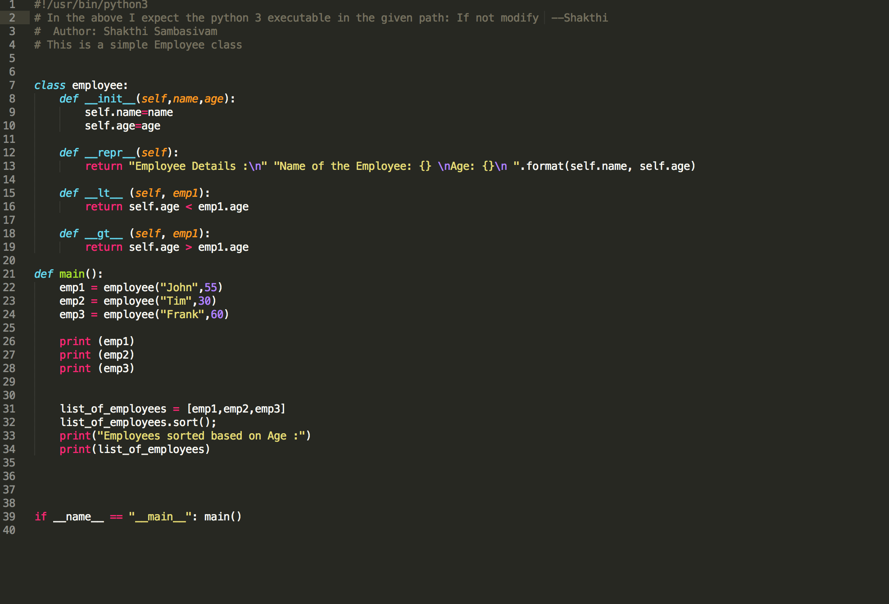
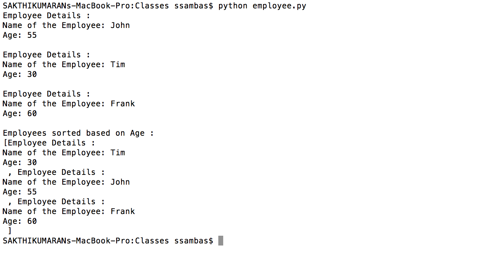

Code 3 HomeWork
================

#Part 1
##Birthday Paradox

#Part 2

Employee Code
-------------

Employee output
---------------

---

#Part 3
##PokerHand

###Result Screenshots:

####For 5 cards per player:

####For 7 cards per player: 

#####COLLABORATORS

+Sakthi Sambasivam (ssambas)

+Nitin Sharma (nsharm10)

+Nakul Shukla (nshukla)
